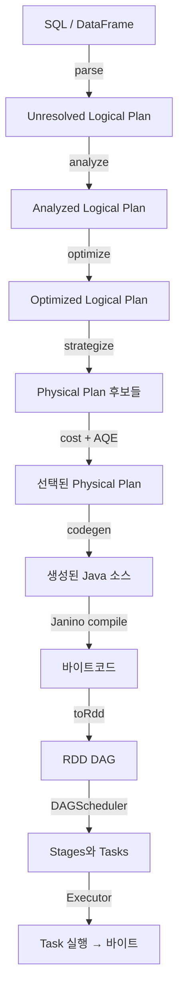

> **Scaffolding 페이지**입니다. 훈련 데이터 사전지식에 기반한 파이프라인
> 뼈대만 담고 있으며, 각 단계의 주장은 `/ingest` 또는 `/trace`가 실제
> 소스에서 증거를 가져온 이후에만 하위 페이지에 기록됩니다.
> `sources:`가 비어 있는 한 이 페이지의 confidence는 `tentative`로
> 유지됩니다.

## L1. What & Why

이 Wiki의 척추. `df.show()`를 호출한 순간부터 바이트가 돌아오는
순간까지 쿼리가 거치는 10개의 변환을 한 장에 정렬한다. 이후의 모든
단계 페이지는 이 다이어그램의 한 화살표 또는 한 노드를 확장한 것이다.
이 페이지의 역할은 설명이 아니라 **탐색(navigation)**이다.

## 파이프라인 다이어그램



ASCII 대응본 (plan tree 인용이나 terminal-friendly 뷰에서 사용):

```
SQL / DataFrame
  │ parse
  ▼
Unresolved Logical Plan
  │ analyze
  ▼
Analyzed Logical Plan
  │ optimize (Catalyst 규칙 배치)
  ▼
Optimized Logical Plan
  │ strategize (SparkStrategies)
  ▼
Physical Plan 후보들
  │ cost + AQE 런타임 재최적화
  ▼
선택된 Physical Plan
  │ WholeStageCodegen
  ▼
생성된 Java 소스
  │ Janino
  ▼
바이트코드
  │ toRdd
  ▼
RDD DAG
  │ DAGScheduler (shuffle 경계로 stage 분할)
  ▼
Stages와 Tasks
  │ TaskScheduler → Executor
  ▼
Executor에서의 Task 실행
```

## 화살표 한 줄 설명

| #   | 화살표                                     | 한 줄 설명                                                                                                | 단계 디렉터리                                                      |
| --- | --------------------------------------- | ----------------------------------------------------------------------------------------------------- | ------------------------------------------------------------ |
| 1   | SQL/DataFrame → Unresolved Logical Plan | ANTLR 기반 파서가 SQL 텍스트 또는 DataFrame API 호출을 이름이 미해결된 LogicalPlan 트리로 바꾼다.                               | [wiki/01-parsing/](../01-parsing/)                           |
| 2   | Unresolved → Analyzed                   | Analyzer가 Catalog를 참조해 관계·속성·함수를 해결하고 타입을 강제 변환한다.                                                    | [wiki/02-analysis/](../02-analysis/)                         |
| 3   | Analyzed → Optimized                    | Catalyst optimizer가 규칙 배치(predicate pushdown, column pruning, constant folding 등)를 불변점에 도달할 때까지 적용한다. | [wiki/03-logical-optimization/](../03-logical-optimization/) |
| 4   | Optimized Logical → Physical 후보         | SparkPlanner 전략들이 logical 연산자를 후보 physical 연산자(join/aggregate 선택, exchange 삽입)로 번역한다.                 | [wiki/04-physical-planning/](../04-physical-planning/)       |
| 5   | Physical 후보 → 선택된 Physical Plan         | 비용 모델과 Adaptive Query Execution이 통계·런타임 관측을 기반으로 실제 실행될 plan을 고른다.                                    | [wiki/05-cost-and-aqe/](../05-cost-and-aqe/)                 |
| 6   | Physical Plan → 생성된 Java                | WholeStageCodegen이 연산자 체인을 하나의 `processNext()` 루프로 fuse해 Java 소스 문자열을 방출한다.                           | [wiki/06-codegen/](../06-codegen/)                           |
| 7   | Java 소스 → 바이트코드                         | Janino가 생성된 소스를 in-memory에서 컴파일해 executor가 로드할 클래스를 만든다.                                              | [wiki/06-codegen/](../06-codegen/)                           |
| 8   | 선택된 Physical Plan → RDD DAG             | `SparkPlan.execute()` 또는 `toRdd`가 physical 트리를 RDD 연산 체인으로 변환한다.                                      | [wiki/07-rdd-and-stages/](../07-rdd-and-stages/)             |
| 9   | RDD DAG → Stages와 Tasks                 | DAGScheduler가 shuffle 의존성을 경계로 DAG를 stage로 자르고, 각 stage를 파티션당 하나의 task로 확장한다.                         | [wiki/08-scheduling/](../08-scheduling/)                     |
| 10  | Stages와 Tasks → Executor 실행             | TaskScheduler가 locality preference에 따라 task를 executor에 디스패치하고, executor가 생성된 바이트코드를 파티션 데이터 위에서 실행한다. | [wiki/09-execution/](../09-execution/)                       |

## 다음 단계

이 페이지는 의도적으로 얕다. 각 화살표의 실제 메커니즘, 레버, 관찰
방법은 해당 단계 디렉터리가 `/ingest` 또는 `/trace`를 통해 채워질 때
기록된다. 탐색 우선순위는 `_meta/_lookup/`의 인덱스들을 보라.
